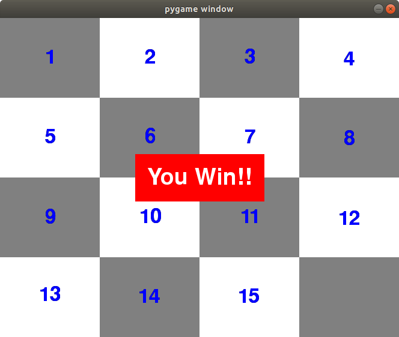

# puzzle-pygame
Some games using pygame module

## slideNumbers.py
The board is divided in squares. One square is free and you can move the boxes around into the free space. The numbers appear mixed and the goal is to put them ordered.

## slideImages.py
The board is a picture divided in squares. One square is free and you can move the boxes around into the free space. There isn't any number and the only hint is the picture itself. The goal is to build again the picture.

