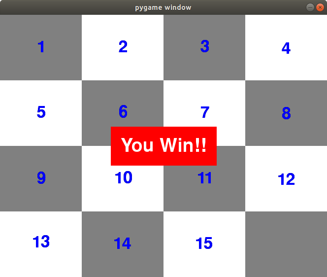

# puzzle-pygame
Some games using pygame module

## slideNumbers.py
The board is divided in squares. One squae is free and you can move the boxes around into the free space. The numbers appear mixed and the goal is to put them ordered.

